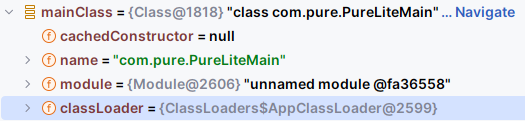
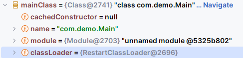

# 开发历程

## Skills

### Object to Map

1、反射获取 Fields 再 put 到 Map 中

2、Object ==> JSON ==> Map （推荐）

...

---

<br>

## 踩坑
### 项目打包

> 项目使用 maven 打包后使用 `java -jar` 运行时提示没有主清单属性。

检查发现 spring-boot-maven-plugin 已经添加。SpringBoot 官方文档中 [Create an Executable JAR with Maven](https://docs.spring.io/spring-boot/docs/current/reference/htmlsingle/#howto.build.create-an-executable-jar-with-maven) 有提到：
如果项目继承了 spring-boot-starter-parent，可以直接添加 spring-boot-maven-plugin 并使用

```xml
<build>
    <plugins>
        <plugin>
            <groupId>org.springframework.boot</groupId>
            <artifactId>spring-boot-maven-plugin</artifactId>
        </plugin>
    </plugins>
</build>
```

如果未使用 spring-boot-starter-parent 仍然可以使用这个插件，但是需要额外添加一个 `<executions>` 标签。

```xml
<plugin>
    <groupId>org.springframework.boot</groupId>
    <artifactId>spring-boot-maven-plugin</artifactId>
    <executions>
        <execution>
            <goals>
                <goal>repackage</goal>
            </goals>
        </execution>
    </executions>
</plugin>
```

...

> **出错的原因**：当前项目使用了 spring-boot-starter-dependencies 而不是继承自 spring-boot-starter-parent，所以需要添加 executions。

...

---

### 项目运行

> 项目启动后访问 pure-pltf-core 中定义的 controller 不生效。跟在 idea 中开发时的行为不一致 =_=

目前的项目结构如下
```
pure-pltf
├── pure-pltf-core
├── pure-pltf-lite
```

其中 pure-pltf 依赖如下
```xml
<!-- pure-pltf pom.xml -->
<dependencyManagement>
    <dependencies>
        <dependency>
            <groupId>org.springframework.boot</groupId>
            <artifactId>spring-boot-dependencies</artifactId>
            <version>2.7.11</version>
            <type>pom</type>
            <scope>import</scope>
        </dependency>
    </dependencies>
</dependencyManagement>
```

pure-pltf-core 继承自 pure-pltf

```xml
<!-- pure-pltf-core pom.xml -->
<parent>
    <groupId>com.pure</groupId>
    <artifactId>pure-pltf</artifactId>
    <version>1.0-SNAPSHOT</version>
</parent>
```

pure-pltf-lite 继承自 pure-pltf，并依赖 pure-pltf-core
```xml
<!-- pure-pltf-lite pom.xml -->
<parent>
    <groupId>com.pure</groupId>
    <artifactId>pure-pltf</artifactId>
    <version>1.0-SNAPSHOT</version>
</parent>

<dependencies>
    <dependency>
        <groupId>com.pure</groupId>
        <artifactId>pure-pltf-core</artifactId>
        <version>1.0-SNAPSHOT</version>
    </dependency>
</dependencies>
```

随后改用 spring-boot-starter-parent，项目结构不变
```shell
pure-pltf
├── pure-pltf-core
├── pure-pltf-lite
```

pure-pltf-core 和 pure-pltf-lite 不再依赖 pure-pltf，直接依赖 spring-boot-starter-parent：

```xml
<parent>
    <groupId>org.springframework.boot</groupId>
    <artifactId>spring-boot-starter-parent</artifactId>
    <version>2.7.11</version>
</parent>
```

> *注意：打包运行的时候要先将 pure-pltf-core 安装到 maven 仓库，再打包 pure-pltf-lite*

...

---

### 配置文件自定义 Info

> 之前的项目中用到 spring-boot-actuator 的时候，在配置文件中添加 info 就可以在 `host:port/actuator/info` 中读取到自定义的 info 信息。
当前项目中用到的 springboot 版本是 2.7.11，直接添加 info 未生效。

...

需要手动注入一个 EnvironmentInfoContributor

```java
@Configuration
public class CoreConfig {
    @Autowired
    private ConfigurableApplicationContext ac;
    /**
     * 自定义 actuator/info 信息
     * EnvironmentInfoContributor 中有一句 binder.bind("info", STRING_OBJECT_MAP).ifBound(builder::withDetails);
     * 意思是绑定 application 配置文件中 info 开头的配置信息
     * 可以通过 http://host:port/actuator/info 访问到
     */
    @Bean
    public EnvironmentInfoContributor environmentInfoContributor() {
        ConfigurableEnvironment environment = ac.getEnvironment();
        return new EnvironmentInfoContributor(environment);
    }
}
```

...

---

### 代码获取 spring-boot-start-actuator 信息

有两种办法获取 actuator 信息：

* RestTemplate

* 注入 HealthEndpoint 和 InfoEndpoint

...

使用 RestTemplate 需要用到项目端口号，actuator 的端口号 management.server.port 不一定就是 server.port。

所以需要判断：如果存在 management.server.port 则使用该端口，否则使用 server.port。

...

要完成判断有两种方式：
* 使用 spEL 判断
* 在代码获取配置值然后判断。

<br>

使用 spEL
```java
// spEL
@Value("#{${management.server.port} ?: ${server.port} ?: 8080}")
private String actuatorPort;
```

...

使用 spEL 的缺点是在配置文件中必须存在 `management.server.port` 和 `server.port` 这两个配置。**可以不设置值，但是必须存在**。否则启动项目的时候就会报错找不到这两个 key。
有一个解决办法是配置文件加上
```properties
spring.config.failOnMissingProperties=false
```
这样就可以关闭 Spring Boot 在启动时对配置项的检查，即使在代码中使用了未定义的配置项也不会报错了。
需要注意的是，关闭这个参数可能会导致配置出现错误而不被发现，可能会给应用程序带来不必要的风险。建议在开发环境中使用，生产环境尽量不要关闭。

...

<br>
在代码获取配置

```java
// 如果配置文件中不存在该 key 返回 null，不会报错
String actuatorPort = ac.getEnvironment().getProperty("management.server.port");
```

...

---

### JAR 包的动态加载与卸载

...

> 两种方法：
> 1、使用自定义的 ClassLoader
> 2、使用 java 命令

...

#### 自定义 ClassLoader 加载外部 jar

**实现细节**

> 详情参见 [boot-pkg](https://github.com/gnl00/boot-pkg)

...

**运行细节**

需要访问动态加载进来的 Jar 包中的类时：需要设置当前线程的上下文 ClassLoader 为【动态加载了该 Jar 的 ClassLoader】。
并且加载完成后将上下文类加载器设置回原来的值，以避免影响其他模块的加载。

```java
public void load(ClassLoader cl) {
    Assert.notNull(cl, "classloader must not be null");

    // 设置当前线程的上下文类加载器
    Thread.currentThread().setContextClassLoader(cl);
    doServiceLoad();

    // 加载完成后将上下文类加载器设置回原来的值，以避免影响其他模块的加载
    Thread.currentThread().setContextClassLoader(getClass().getClassLoader());
}

public void doServiceLoad() {
    ServiceLoader<BootSpi> services = ServiceLoader.load(BootSpi.class);
    for (BootSpi serviceImpl : services) {
        serviceImpl.load(); // 执行子类的对应方法
    }
}
```

#### java -cp 和 -jar 命令

假如存在一个 SpringBoot 应用打包成的 application.jar，以下两条命令运行效果相同

```shell
java -jar application.jar # 1
java -cp application.jar org.springframework.boot.loader.JarLauncher # 2
```
...

打包好的 jar 会有一个 `MANIFEST.MF` 文件，文件内容大概如下

```manifest
Manifest-Version: 1.0
Created-By: Maven JAR Plugin 3.3.0
Build-Jdk-Spec: 17
Implementation-Title: boot-pkg-lite
Implementation-Version: 1.0-SNAPSHOT
Main-Class: org.springframework.boot.loader.JarLauncher
Start-Class: com.demo.lite.LiteMain
Spring-Boot-Version: 3.0.6
Spring-Boot-Classes: BOOT-INF/classes/
Spring-Boot-Lib: BOOT-INF/lib/
Spring-Boot-Classpath-Index: BOOT-INF/classpath.idx
Spring-Boot-Layers-Index: BOOT-INF/layers.idx
```

...

Main-Class 指明应用程序的主启动类，即含有 `public static void main(String[] args)` 方法的类。

`java -jar` 可以执行一个封装好的 jar 包。

使用 `-jar` 时，运行的 Java 应用的 CLASSPATH 是系统环境变量中的 CLASSPATH，其他的类路径设置将被忽略。

例如，如果使用 `java -cp <your_classpath> -jar application.jar` 来运行程序的话，其中 `-cp` 部分指定的参数是无效的。

...

```shell
java -cp <your_classpath>
java -classpath <your_classpath>
java --class-path <your_classpath>`
```

上面这几条命令执行的效果是相同的。指定的 classpath 会覆盖系统的 CLASSPATH 环境变量。
如果没有使用 classpath 参数，也没有设置系统 classpath，那么此时的 classpath 就是当前目录 `.`。

...

如果需要加载多个 JAR 文件，Linux/Unix 使用 `:` 来作为分隔符，Windows 使用 `;`。

`java -cp abc.jar:edf.jar:123.jar <main-class>`

此外，还可以使用 `*` 来加载某路径下所有 JAR 文件 `java -cp "./lib/*" <main-class>`，加载 lib 子目录下的所有 JAR 文件。

...

#### 两种方式对比

使用 ServiceLoader 来加载更加灵活，不需要先将 JAR 文件放入 classpath 中，只需要自定义好 ClassLoader，用来动态加载外部 JAR 即可。

`java -cp` 方式需要在项目启动时指定 classpath，后续如果引入外部 JAR 需要先将外部 JAR 文件保存到 classpath，然后再刷新 classpath 才能使用新引入的文件。

本项目使用第一种方法。

#### ServiceLoader.load() 探析

```java
public static <S> ServiceLoader<S> load(Class<S> service) {
    // 获取当前上下文 ClassLoader
    ClassLoader cl = Thread.currentThread().getContextClassLoader();
    return new ServiceLoader<>(Reflection.getCallerClass(), service, cl);
}

private ServiceLoader(Class<?> caller, Class<S> svc, ClassLoader cl) {
    // svc => SPI 接口
    // cl => ClassLoader
    Objects.requireNonNull(svc);

    // 如果未指定 ClassLoader 则使用 SystemClassLoader 来加载
    if (VM.isBooted()) {
        checkCaller(caller, svc);
        if (cl == null) {
            cl = ClassLoader.getSystemClassLoader();
        }
    } else {

        // 如果当前处于 VM 初始化时机，只有 java.base 这个包内的代码能执行
        
        // if we get here then it means that ServiceLoader is being used
        // before the VM initialization has completed. At this point then
        // only code in the java.base should be executing.
        Module callerModule = caller.getModule();
        Module base = Object.class.getModule();
        Module svcModule = svc.getModule();
        if (callerModule != base || svcModule != base) {
            fail(svc, "not accessible to " + callerModule + " during VM init");
        }

        // restricted to boot loader during startup
        cl = null;
    }

    this.service = svc;
    this.serviceName = svc.getName();
    this.layer = null;
    this.loader = cl;
    // 返回一个 AccessControlContext
    // AccessControlContext 用于根据它所封装的上下文做出系统资源访问决定
    this.acc = (System.getSecurityManager() != null)
            ? AccessController.getContext()
            : null;
}
```

#### 总结

> 在编写这个功能时第一个想到的是 SPI 使用 ServiceLoader.load 方法，但是刚开始没有自定义 ClassLoader，无法正常加载外部 JAR。
>
> 然后转向另一个方法 `java -cp ./lib/* -jar application.jar` 应用启动没问题，但一开始并不知道 `-cp` 和 `-jar` 的关系。
>
> 使用 Environment 类查看 classpath 发现只有 application.jar，其他的 jar 并未被引入。
>
> 原来指定 `-jar` 之后会忽略 `-cp` 指定的 CLASSPATH。这两个命令使用时只能二选一。
>
> 还有一点是 `java -cp ./lib/*` 需要给 `-cp` 的参数加上双引号 `java -cp "./lib/*"`，否则无法解析这条命令。

...

---

### JAR 包的动态卸载

动态卸载 JAR 目前想到的方法：
1. 将 JAR 包从 plugins 目录中删除，然后重启应用；
2. 每动态加载一个 JAR 都使用一个单独的 ClassLoader，需要卸载该 JAR 的时候直接让 JVM 回收对应的 ClassLoader（目前选择了此方法）

...

---

### Ddev-tools 之 ClassLoader 坑

有一段代码如下

```java
Path pkgPath = Paths.get("pure-pltf-plugin-example-1.0-SNAPSHOT.jar");
File file = pkgPath.toFile();
URL url = file.toURI().toURL();
TestClassLoader classLoader = new TestClassLoader(new URL[]{url});
ServiceLoader<SPI> services = ServiceLoader.load(SPI.class, classLoader);
System.out.println(SPI.class.getClassLoader());
for (SPI service : services) {
  System.out.println(service);
  service.print();
}
```

使用自定义的 ClassLoader 加载根目录的 jar 包，很简单的逻辑。

但是这段代码在不同的类居然会有不同的表现？

先来看一下目录结构

```shell
pure-pltf
├── pure-pltf-base SPI 接口在这里
├── pure-pltf-core 我们定义的代码在这里
├── pure-pltf-plugin-example 这里有 SPI 的实现 SPIImpl
├── ...
```

其中 SPIImpl 的实现如下

```java
public class SPIImpl implements SPI {
    @Override
    public void print() {
        System.out.println("+++++ implement output +++++");
        System.out.println("spi implement...");
    }
}
```

接下来在一个普通的 core 目录中的一个普通类实现上面的代码并运行

```java
public class Test {
    public static void main(String[] args) throws MalformedURLException {
        Path pkgPath = Paths.get("pure-pltf-plugin-example-1.0-SNAPSHOT.jar");
        File file = pkgPath.toFile();
        URL url = file.toURI().toURL();
        TestClassLoader classLoader = new TestClassLoader(new URL[]{url});
        ServiceLoader<SPI> services = ServiceLoader.load(SPI.class, classLoader);
        for (SPI service : services) {
            service.print();
        }
    }
}
```

运行成功输出内容如下：

```
+++++ implement output +++++
spi implement...
```

很好，符合我们的要求。

接下来将这段代码放到 Controller 中实现

```java
@GetMapping("/test")
public void test() {
  try {
    Path pkgPath = Paths.get("pure-pltf-plugin-example-1.0-SNAPSHOT.jar");
    File file = pkgPath.toFile();
    URL url = file.toURI().toURL();
    TestClassLoader classLoader = new TestClassLoader(new URL[]{url});
    ServiceLoader<SPI> services = ServiceLoader.load(SPI.class, classLoader);
    System.out.println("===== classloader in controller =====");
    System.out.println(SPI.class.getClassLoader());
    for (SPI service : services) {
      System.out.println(service);
      service.print();
    }
  } catch (MalformedURLException e) {
    throw new RuntimeException(e);
  }
}
```

结果如下：

```
java.util.ServiceConfigurationError: com.pure.SPI: com.example.SPIImpl not a subtype
	at java.util.ServiceLoader.fail(ServiceLoader.java:593) ~[?:?]
	at java.util.ServiceLoader$LazyClassPathLookupIterator.hasNextService(ServiceLoader.java:1244) ~[?:?]
	at java.util.ServiceLoader$LazyClassPathLookupIterator.hasNext(ServiceLoader.java:1273) ~[?:?]
	at java.util.ServiceLoader$2.hasNext(ServiceLoader.java:1309) ~[?:?]
	at java.util.ServiceLoader$3.hasNext(ServiceLoader.java:1393) ~[?:?]
	at com.pure.controller.PluginController.install(PluginController.java:85) ~[classes/:?]
	at com.pure.controller.PluginController.test(PluginController.java:123) ~[classes/:?]
```

？？？

上文中已经贴出 SPIImpl 的代码

```java
public class SPIImpl implements SPI
```

**SPIImpl 已经实现了 SPI 接口**，为什么报错 `com.pure.SPI: com.example.SPIImpl not a subtype` SPIImpl  不是 SPI 的子类？

> 可恶！

哪里出问题了呢？

> **问题出现在 ClassLoader 上**。

因为加载 SPI 的 ClassLoader 不一致，导致当前 JVM 中就出现了两个 SPI 类元对象。

让我们修改一下实现类

```java
public class SPIImpl implements SPI {
    @Override
    public void print() {
        System.out.println("===== classloader in implement =====");
        System.out.println(SPI.class.getClassLoader());
        System.out.println("+++++ implement output +++++");
        System.out.println("spi implement...");
    }
}
```

将 SPI 的 ClassLoader 输出看看

```
===== classloader in implement =====
jdk.internal.loader.ClassLoaders$AppClassLoader@2b193f2d
+++++ implement output +++++
spi implement...
```

是熟悉的 AppClassLoader。

回头再看看 Controller 中 SPI 类的 ClassLoader

```java
@GetMapping("/test")
public void test() {
  try {
    Path pkgPath = Paths.get("pure-pltf-plugin-example-1.0-SNAPSHOT.jar");
    File file = pkgPath.toFile();
    URL url = file.toURI().toURL();
    TestClassLoader classLoader = new TestClassLoader(new URL[]{url});
    ServiceLoader<SPI> services = ServiceLoader.load(SPI.class, classLoader);
    System.out.println("===== classloader in controller ====="); // 加上1
    System.out.println(SPI.class.getClassLoader()); // 加上2
    for (SPI service : services) {
      System.out.println(service);
      service.print();
    }
  } catch (MalformedURLException e) {
    throw new RuntimeException(e);
  }
}
```

加上 2 行代码，运行查看输出

```
===== classloader in controller =====
org.springframework.boot.devtools.restart.classloader.RestartClassLoader@36d931b9
```

恍然大悟。

> 可恶！devtools！

结果正如上面说的一样，是因为加载 SPI 的两个 ClassLoader 不一致，导致的这个问题。

> 接下来只要将 devtools 依赖去掉即可。

去掉之后再次查看输出：

```
===== classloader in controller =====
jdk.internal.loader.ClassLoaders$AppClassLoader@2b193f2d
com.example.SPIImpl@24ef3a3e
===== classloader in implement =====
jdk.internal.loader.ClassLoaders$AppClassLoader@2b193f2d
+++++ implement output +++++
spi implement...
```

舒服了:satisfied:

...

---

### 破坏双亲委派机制

…

---

<br>

## 碎碎念

**Update-9**

接下来测试主应用与插件的跨容器调用。

…

**Update-8**

类加载器解决了。坏消息是：SpringBoot 启动两次了。

```shell
org.springframework.beans.factory.BeanCreationException: Error creating bean with name 'springApplicationAdminRegistrar'
...
Caused by: javax.management.InstanceAlreadyExistsException: org.springframework.boot:type=Admin,name=SpringApplication
...
```

应用已经启动了为什么还会再启动一次？

因为在 Restart#start 启动的时候

```java
private void start() throws InterruptedException, ClassNotFoundException {
  PltfClassLoader pltfClassLoader = new PltfClassLoader(new URL[]{});
  pltfClassLoader.setAppName(this.args[this.args.length - 1]);
  Launcher launcher = new Launcher(pltfClassLoader, mainClassName, args);
  launcher.start();
  launcher.join(); // Waits for this thread to die
  System.out.println("Launcher thread finished, exiting");
}
```

launcher 线程结束了，于是之前的主线程继续

> 问题不大，修改一下

```java
private void start() throws InterruptedException, ClassNotFoundException {
  PltfClassLoader pltfClassLoader = new PltfClassLoader(new URL[]{});
  pltfClassLoader.setAppName(this.args[this.args.length - 1]);
  Launcher launcher = new Launcher(pltfClassLoader, mainClassName, args);
  launcher.start();
  launcher.join(); // Waits for this thread to die
  for (;;) {} // stuck here
}
```

让该线程一直等待，不退出。

…

**Update-7**

受 DevTools 启发，自定义 ClassLoader 加载启动类。

```java
PltfClassLoader pltfClassLoader = new PltfClassLoader(new URL[]{}, getClass().getClassLoader());
Class<?> mainClass = Class.forName(this.mainClassName, false, pltfClassLoader);
```

这句代码看起来没什么问题…但是，表现的结果却和期望不一样。

这里明确指定了使用 PltfClassLoader 来加载启动类，但是 debug 的时候却发现仍然是使用 AppClassLoader 来加载主启动类的？



…

> 如果是简单的：
>
> ```java
> Class<?> mainClass = Class.forName(this.mainClassName);
> ```
>
> 这个流程是可以理解的，PltfClassLoader 作为 AppClassLoader 的子启动类，PltfClassLoader 在进行类加载的时候是会遵循双亲委派原则的。所以 PltfClassLoader 加载主启动类的时候会向上级类加载器寻找查看是否由加载过主启动类的类加载器，很巧就找到了 AppClassLoader，于是就利用 AppClassLoader 来加载主启动类了。

但令人费解的是：这套模式是基于 DevTools 来实现的，在对 DevTools 进行 debug 的过程中可以发现



> **主启动类是由 RestartClassLoader 来加载的**。

和我们的行为不一致，什么原因呢？

只有一个解释：**DevTools 在进行主启动类加载的时候不遵循双亲委派机制**。

> 可恶！被摆了一道！:angry:

将 RestartClassLoader 中所有的重写方法都打上断点，来会一会它。跟着断点执行，我们得到下面的流程：

1. RestartClassLoader 构造方法
2. RestartClassLoader#loadClass，这一步会使用 synchronized 锁确保只创建一个新的主启动类
3. …

> 家人们，找了半天，无法重现 DevTools 破坏双亲委派机制，破防了:cry:

> 另寻他路:thinking:

>  好消息！:smile:

经过一番重写

```java
@Override
protected Class<?> loadClass(String name, boolean resolve) throws ClassNotFoundException {
  String path = name.replace('.', '/').concat(".class");
  Path realPath = Paths.get(this.appName, CLASSES_FILE, path);
  synchronized (getClassLoadingLock(name)) {
    Class<?> loadedClass = null;
    File classFile = new File(realPath.toString());
    if (classFile.exists()) {
      try (InputStream fis = new FileInputStream(classFile)) {
        byte[] content = fis.readAllBytes();
        loadedClass = defineClass(name, content, 0, content.length);
      } catch (IOException e) {
        throw new RuntimeException(e);
      }
      return loadedClass;
    } else {
      return super.loadClass(name, resolve);
    }
  }
}
```

现在已经能顺利在第二次加载的时候使用自定义的类加载器来加载了！

```shell
ClassLoader for now: jdk.internal.loader.ClassLoaders$AppClassLoader@2b193f2d
PltfApplicationListener init
Immediately restarting application
classloader in launcher#run cl: com.pure.classloader.PltfClassLoader@1169afe1
ClassLoader for now: com.pure.classloader.PltfClassLoader@1169afe1
```

…

**Update-6**

如果想要添加 Websocket 插件，

SpringBoot 中如何添加？

1、添加依赖

2、配置暴露的 url，处理 open/close，将 Websocket 处理类加入 IOC 容器

3、启动

> 有点简单的。

插件该如何实现这一逻辑呢？

> 一、自定完成代码逻辑，由 exec 调用。

不合理，需要实现的代码逻辑太多了。

> 二、基于 SpringBoot

如何让插件也支持 SpringBoot？

如果单纯给插件引入 spring-boot-start，然后通过 exec 来执行 该插件的 SpringApplication#run？

这样子的话我们的应用【Lite】 和【插件】是*不共用一个 IOC 容器*的。

如何实现跨 IOC 的交互？或者如何只使用一个 IoC 来管理应用的整个生命周期?

IOC 是什么？本质上是一个 Map，一个 ConcurrentHashMap。

或许可以利用 DevTools 的逻辑实现热部署？详情查看 [how-sb-devtools-works](https://github.com/gnl00/how-sb-devtools-works)

> 也就是说，后续的所有类加载都交由 RestartClassLoader 来完成了。同样的，我们感兴趣的 IoC 容器也是。

那么思路就有了：有样学样，我们也**使用自定义的类加载器，来接管从应用启动到后续整个生命周期中类的加载**，暂且称它为【自定义 AppClassLoader】。甚至加载插件的时候也使用这个 【自定义 AppClassLoader】来加载

> 这样子的话我们就不能使用多个类加载器来加载插件了，需要使用到代理类来执行。前面的话是什么意思？详情查看 [boot-pkg](https://github.com/gnl00/boot-pkg?tab=readme-ov-file#classloader-%E4%BB%A3%E7%90%86)

…

> 一顿操作猛如虎之后发现…
>
> 是不是在 main 方法创建一个新的线程 Restart 然后 setContextClassLoader 也能达到要求？

不行，从 main 方法设置的话就会被用户感知到。不优雅。

…

---

**Update-5**

> 记一次 BeanPostProcessor 的使用

目前项目结构如下

```
pure-pltf
├── pure-pltf-base
├── pure-pltf-core 这里有一个 application.yaml
├── pure-pltf-lite 这里也有一个 application.yaml
├── pure-pltf-plugin-example
├── ...
```

其中

core/appilcation.yaml 内容如下

```yaml
management:
  endpoints:
    web:
      exposure:
        include: "*"
  endpoint:
    health:
      show-details: always
```

> 很简单，将端口暴露并展示应用健康的详细信息。

但是，SpringBoot 的 main 方法是定义再 lite 中的，无法获取到 core 中的 application.yaml 配置，所以说这个配置是无效的。SpringBoot 无法获取到 core/appilcation.yaml 配置中的内容。

…

> 于是就想着在代码中完成这一配置。

主要修改 pure-pltf-core 中的内容。修改 SpringBoot 内置类的属性，很容易就能想到：利用 @Autowired 获取该类的实例，然后修改属性。

是的，第一次尝试我也是这么做的。

在配置类中添加代码

```java
@Autowired
private HealthEndpointProperties healthEndpoint;

@PostConstruct
public void afterConstruct() {
  log.info("HealthEndpointProperties setShowDetails: {}", "Show.ALWAYS");
  healthEndpoint.setShowDetails(HealthProperties.Show.ALWAYS); // 如何找到这个配置的呢？从 spring-boot-actuator 源码中
}
```

为了测试再从 Controller 输出

```java
@Autowired
private HealthEndpointProperties healthEndpoint;

@GetMapping("/test")
public void test() {
  System.out.println(healthEndpoint.getShowDetails());
}
```

运行并请求，查看输出

```
ALWAYS
```

修改成功，接下来请求 `http://localhost:8080/actuator/health`，查看是否输出了详细的健康信息

```json
{
    "status": "UP"
}
```

遗憾的是并没有。

> 属性修改成功了，但是产生的效果和我们预期的并不一样。

什么原因呢？

> 是**因为属性设置的时机不对**，我们一开始选择配置类中的 @PostConstruct 设置 HealthEndpointProperties#setShowDetails 的时机不对。

只能是因为设置值得时机慢了。如何解决？

可以使用 BeanPostProcessor

```java
@Component
public class HealthEndpointPropertiesPostProcessor implements BeanPostProcessor {
    @Override
    public Object postProcessAfterInitialization(Object bean, String beanName) throws BeansException {
        if (bean instanceof HealthEndpointProperties) {
            HealthEndpointProperties healthEndpoint = (HealthEndpointProperties) bean;
            healthEndpoint.setShowDetails(HealthEndpointProperties.Show.ALWAYS);
        }
        return bean;
    }
}
```

只要在该 Bean 一被创建的时候就立马设置上我们自定义的值，就可以了。

整理代码，再次运行并测试

```json
{
    "status": "UP",
    "components": {
        "diskSpace": {
            "status": "UP",
            "details": {
                "total": 168943423488,
                "free": 56647806976,
                "threshold": 10485760,
                "exists": true
            }
        },
        "ping": {
            "status": "UP"
        }
    }
}
```

成功。

…

---

**Update-4**

> 记一次 springboot-devtools 踩坑

目前在拆分项目，从 pure-pltf-core 拆出 pure-pltf-base。在 base 中定义插件接口，后面自定义插件只需要依赖 base 就可以了。

然后编写了一个插件样例，pure-pltf-plugin-example，引入 base 依赖，其中只有一个类

```java
public class ExamplePlugin implements Plugin {
    @Override
    public void exec() {
        System.out.println("executing example plugin...");
    }

    @Override
    public Metadata init() {
        return new Metadata("example-plugin", "a example plugin", "1.0");
    }
}
```

接着就开心的去测试了…

结果，

加载插件的时候报错

```java
java.util.ServiceConfigurationError: com.pure.Plugin: com.example.ExamplePlugin not a subtype
```

WTF？？

OK 开始排查。

…

---

**Update-3**

> 手动注入一个 EnvironmentInfoContributor 读取配置文件中的自定义 info

…

**Update-2**
> 第一步，先做一个全平台的信息收集接口，可以全自动收集当前已加载的应用信息，以及收集安装的应用信息。
> 一些基础的信息可以从 Environment 类或者直接从 pom.xml 获取。

…

**Update-1**
> 后端：
> 目前看来难度不大。主要用到了 Java 的 SPI 机制，只要暴露好接口，提供给外部实现即可。
>
> 前端：
> 可以从前端页面选择加载并安装对应的功能

…
